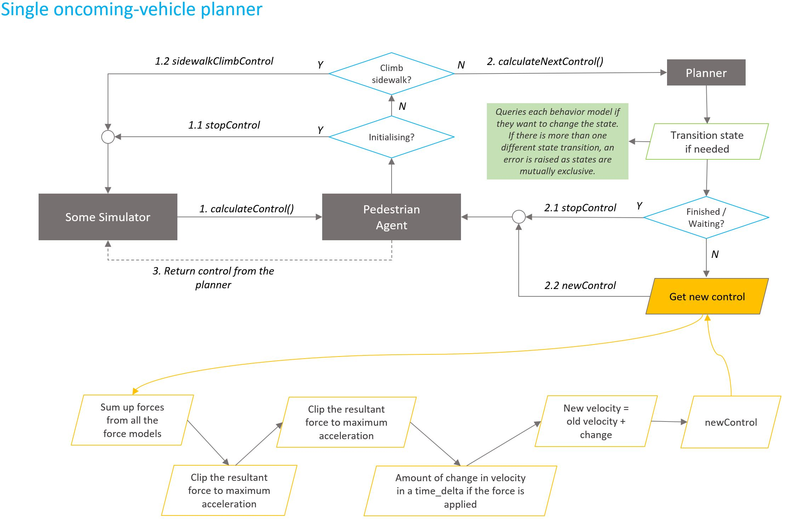

The overall simulation architecture is shown here using a *Single Oncming Vehicle Planner*:

The core idea is simulator queries agents for new controls every tick. It's the simulators responsibility to **apply** the control.

The agent itself handles two special case situations: initialising state of the pedestrian and when the pedestrian needs to climb a sidewalk. Planner handles rest of the behavior by applying models. The planner has two stages of operations:

1. State transition stage: In this stage, the planner queries the behavior models if they want to change the current state of the pedestrian. The planner **changes** the state if and only if all the change requests result in a new state. Models are free to have their internal states.
2. Control calculation stage: In this stage, the planner queries the behavior (force) models again to get forces. Then the planner usually sums up the forces, and calculate the required change in current control to derive new control. The control is sent back to the Simulator.