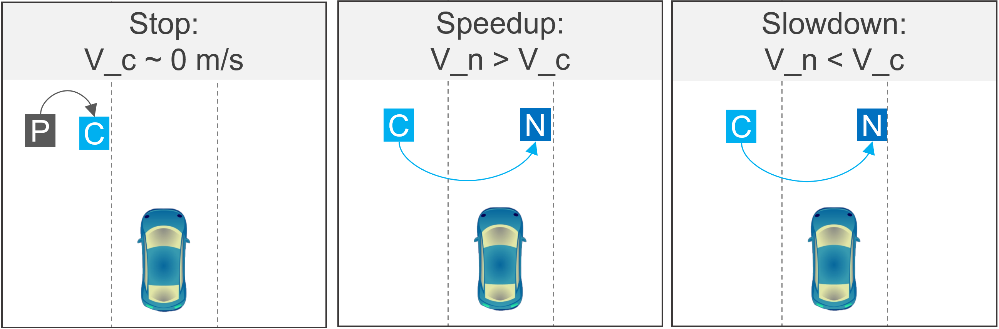
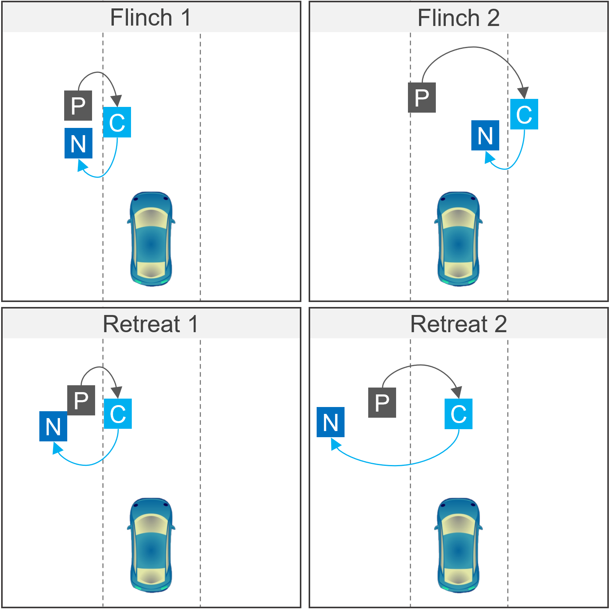

## Behavior Primitives
1. **Evasive Stop**: It represents a complete stop inside a road while crossing. %This can happen due to different factors such as a vehicle passing fast in front, occlusions, or sudden blindness due to headlights. Evasive stop lasts until the conflict is resolved.
2. **Evasive Flinch**: It is similar to an Evasive Stop with an additional backward movement pattern that happens involuntarily and within a fraction of a second. %In this case, the pedestrian moves back a little bit into another lane as a physical instinct. This behavior creates a dangerous situation in the lane the pedestrian enters.
3. **Evasive Retreat**: In this one, the pedestrian voluntarily moves back until they are safe from an approaching vehicle which can take a few seconds.
4. **Evasive Speedup**: This primitive modifies the pedestrian's trajectory to a higher speed to evade the approaching vehicle. 
5. **Evasive Slowdown**: In this case, the pedestrian slows down to let the vehicle pass. Often this results in near-collision situations.

## Behavior Matcher

Identifying behavior primitives in trajectories is our active research topic. The primitive matching methods are constraint-based search methods over previous and next NavPoints of the NavPoint being tagged with behaviors. Unless specified all the behavior primitive has one common constraint of the current NavPoint being in front of the ego vehicle. The constraints for each primitive are set forth below: Code at [BehaviorMatcher.py](../agents/pedestrians/soft/BehaviorMatcher.py).

1. **Evasive Stop**: the NavPoint a speed less than the evasive stop threshold (defaults to 0.1 m/s). All of the following must hold: 
    - The previous and the next NavPoints are on the same side as the current one.
    - The next NavPoint is at under lateral displacement threshold (defaults to one lane section distance) from the current.
    - The previous and the next NavPoints are under displacement threshold along the vehicle travel axis (defaults to 0.5 meters). 
2. **Evasive Retreat**: all of the following must hold: 
    - There is a next NavPoint at over lateral displacement threshold (defaults to two lane section distance) from the current.
    - The next NavPoint meeting the former constraint and the previous NavPoint of the current must be on the same side of the current.
    - The next NavPoint meeting the former constraint and the previous NavPoint of the current are under displacement threshold along the vehicle travel axis (defaults to 0.5 meters). 
3. **Evasive Speedup**: all of the following must hold: 
    - There exists a next NavPoint which is in front of the vehicle and on the vehicle lane.
    - That next NavPoint has a higher speed than the current.
    - The direction from the current and the next is the same as the pedestrian's crossing direction.
4. **Evasive Slowdown**: In this case there is a next NavPoint which:  
    - is on the same side as the current.
    - lower speed than the current.
    - has no future NavPoints in front of the ego.