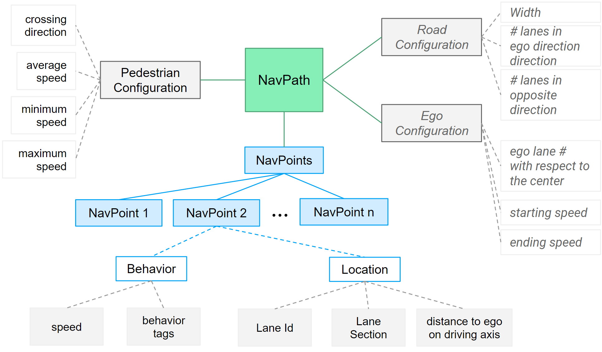
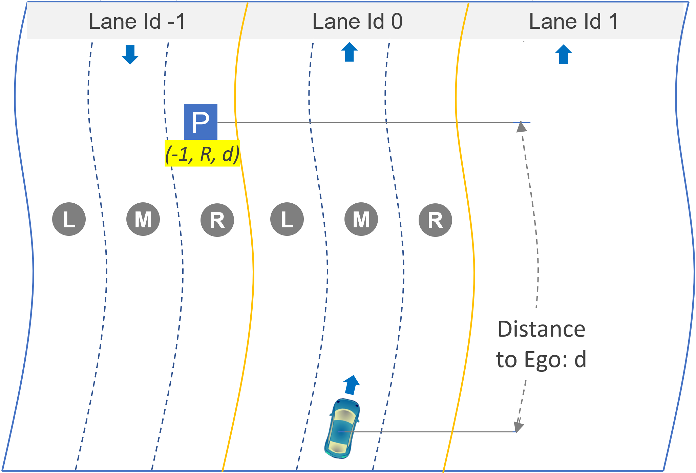

## NavPath Representation

A NavPath, comprised of NavPoints, is a sparse pedestrian trajectory in the ego vehicle's coordinate system. Each pedestrian in a scenario is described as a NavPath.
%A NavPathit highlights path structure and behavioral shifts. NavPaths can originate from dense trajectories or video-based crafting, focusing on behaviorally significant points, like abrupt stops. They highlight path structure and behavioral shifts. NavPaths can originate from dense trajectories or video-based crafting, focusing on behaviorally significant points, like abrupt stops. 

Key NavPath characteristics include:
- Represents only coarse directional movement, abstracting away micro-level behavioral variation. %This allows the argumentation of details. 
- Tied to the vehicle coordinate system, so, if the vehicle reference frame moves, it also moves.
- Can be somewhat imprecise, allowing for flexibility in scenario crafting.

The Navpath's goal is to record behavior changes (which occur at NavPoints) and travel direction in pedestrian movement. These elements challenge ego vehicle prediction models. This representation play the central role of representing diversity in pedestrian paths and behavior, whether manually crafted or automatically derived from real-world data or trained models.

The figure illustrates the structure of a NavPath. A NavPath contains a set of NavPoints, each of which has associated behavioral and location properties. The NavPath itself also contains properties for pedestrian information such as crossing direction (left-to-right or right-to-left) relative to the ego vehicle's travel axis. 

## NavPoint Representation

A NavPoint captures a pedestrian's state at a specific time step in relation to the vehicle. Key NavPoint properties include:

- LaneId: 0 for the ego vehicle's lane, negative for left, and positive for right lanes, allowing for translation with ego vehicle lane changes.
- Lane Section: Each lane is divided into three sections: LEFT, MIDDLE, and RIGHT, approximating four feet in a standard city lane. This representation offers lateral variation within two human steps.
- Distance to Ego: Distance to Ego measured on the ego vehicle axis of travel. 
- Speed: Original pedestrian speed, aiding Behavior Matcher [Behavior Matcher](./adaptive-soft-model-behavior.md) in identifying [Behavior Primitives](./adaptive-soft-model-behavior.md).

NavPoint properties serve *three objectives*:

1. NavPoints can be re-targeted against different road structures and ego vehicle locations in world coordinates.
2. Translation of behaviorally interesting locations in time and space based on the ego vehicle's behavior.
3. Application of fuzzing techniques without losing the behavioral connection to the ego vehicle.

NavPoint Example. This is a three-lane road, with one lane to the right and left of the ego vehicle. Each lane is divided into (L)eft, (M)iddle, and (R)ight sections with respect to the ego's travel direction, not the driving direction of the lane. Lane Ids are assigned relative to the ego vehicle (lane 0). Distance is measured on the vehicle's travel axis. NavPoint P has Lane Id: -1, Lane Section: R, and distance: d.