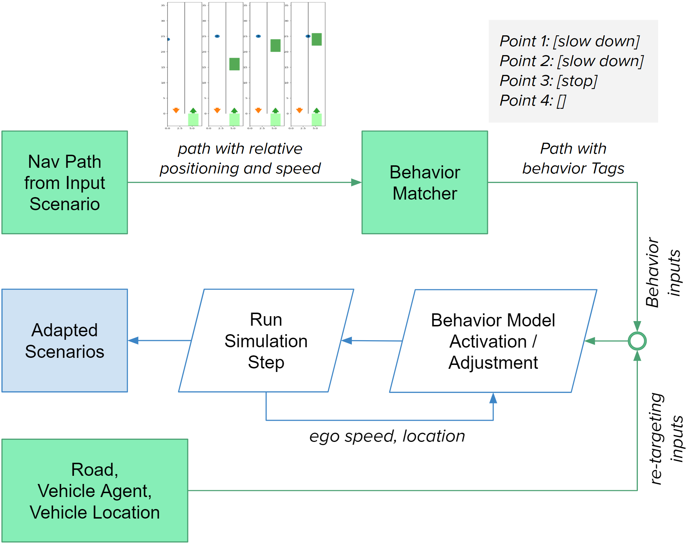
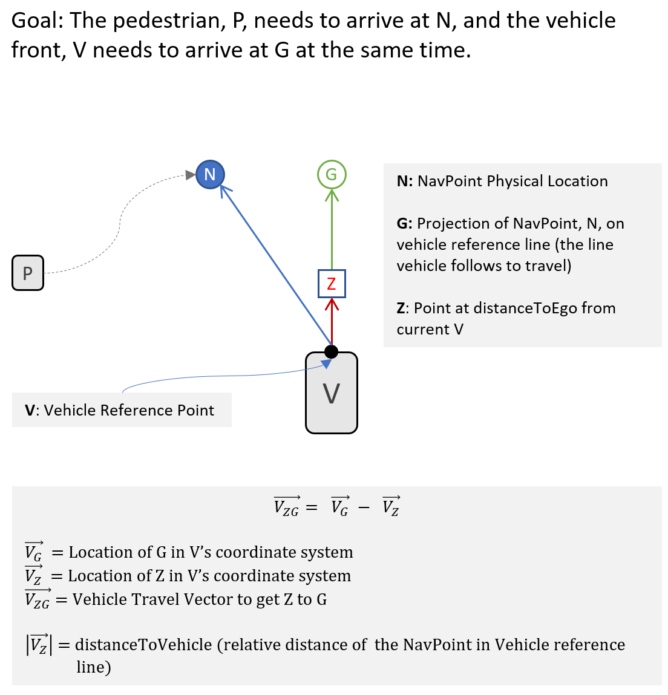
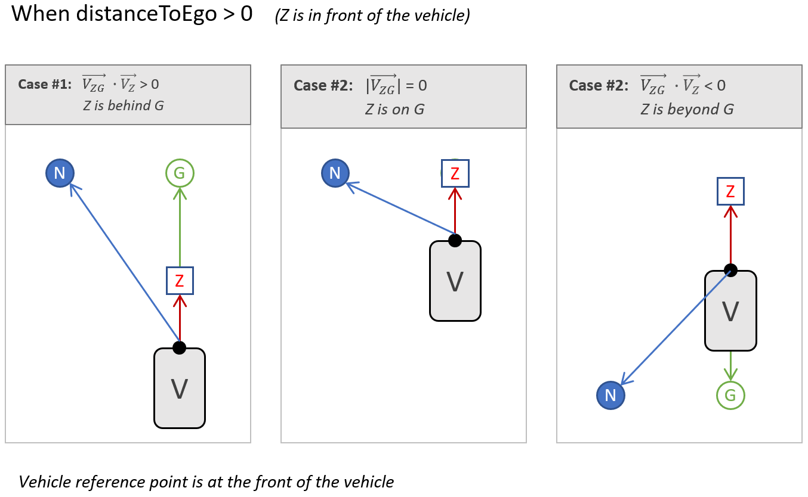
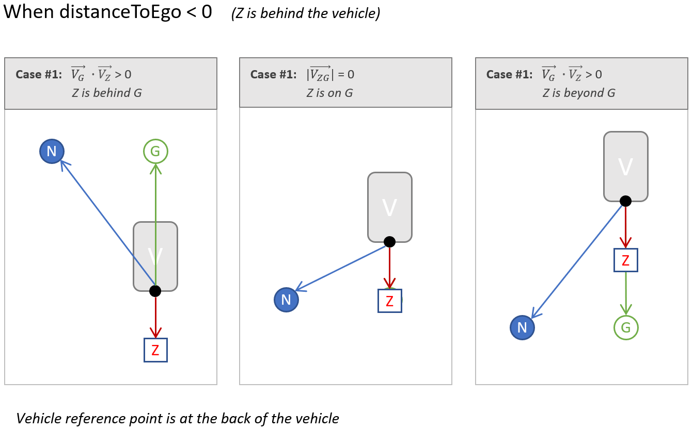

# Adaptive Pedestrian Agent Modeling for Scenario-based Testing of Autonomous Vehicles through Behavior Transfer/Re-targeting

Given a pedestrian crossing video, we want to generate scenarios that shows similar pedestrian behavior with contextual variations. We can achieve this by retargeting the behavior of pedestrians against:
1. Number of lanes in the road
2. Width of lanes
3. Ego vehicle’s lane
4. Ego vehicle’s speed profile

 
In this video, the pedestrian walks along the left lane for a while, and starts crossing the road. When it sees an approaching vehicle, it makes a stop on the left lane. We can retarget this behavior by expressing the behavior as a relative navigation path with respect to the ego vehicle.

## Approach
1. We extract minimal information (interesting points) from a real-world scenario (video/trajectory data) that can be reconstructed in different contexts. The representation is called NavPath. [Check here for details](./adaptive-soft-model-navpath.md)

2. In the reconstruction process, we introduce social-force/rule-based models to produce maneuvers at the interesting points. Check [Behavior Models](./adaptive-soft-model-behavior.md) for more information.

# Implementation Details

This section discusses the simulation process. For detailed information of microscopic behavior maneuvers, Check [Behavior Models](./adaptive-soft-model-behavior.md) for more information.

## Demo

In the following video, PSI-0002 Scenario Reconstructed and Retargeted using Soft Pedestrian Modeling for AV Testing. Access to the PSI dataset is [here](https://github.com/PSI-Intention2022/PSI-Dataset).

## NavPath Placement (NavPoint Realization)

1. Before the episode, NavPoints are translated into the world coordinate system based on the Ego vehicle's position in the world space. They are put a bit further so that the vehicle can catch up with it's desired velocity.
2. When the pedestrian reaches the NavPoint, they are distanceToEgo far away from the Ego on the Ego's reference line (Ego coordinate system). We do it by estimating the travel time of the vehicle and adjusting pedestrian speed accordingly.

Here goes the technical solution

Based on whether the NavPoint is relatively located in front of the vehicle or behind the vehicle, the calculations change a little bit.

