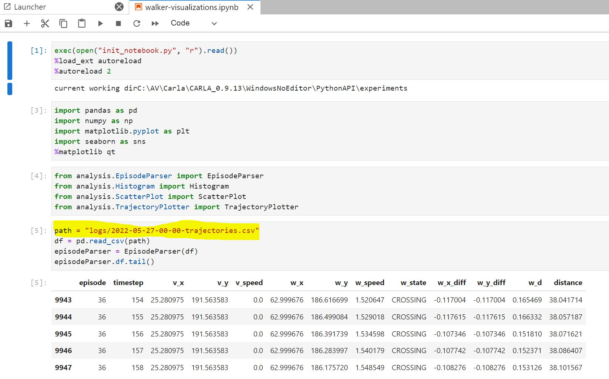

Several research classes (e.g., Research1v1) collects trajectory information of the traffic participants. All the **r1v1\*_.py** research runners use Research1v1. They will save the trajectory information of a simulation session into a CSV file in the logs folder. The name of the CSV file is "YYYY-mm-dd-hh-mm.csv". Each file has data of multiple episodes of a single simulation run. An **episode** starts when the walker is spawned and ends when the walker reaches its destination.

Here are the steps to get familiar with the analysis and evaluation process:


1. Run your simulation with command line parameter: *--max_ticks=10000* or more. There should be at least 30 episodes for 10k ticks. 
2. Locate the csv file for the run under the logs folder.
3. Open notebooks/walker-visualizations.ipynb notebook in jupyter notebook / jupyter lab, visual code. If you are using anaconda, installing jupyter notebook is one click job. Activate the environment and click "install" in the navigator software list. VS code has a notebook extension which you can install from extensions tab.
4. You may need to install some more python packages:

    ```
    conda install -c anaconda seaborn
    ```

5. After you open the notebook, set the path to your CSV file (*see the highlighting*):




6. If you run cells from 1 to 5, you should be able to see some rows of the CSV file. Play with other cells in the notebook. If you want to come up with more visualizations and analysis, you can contribute to this notebook!