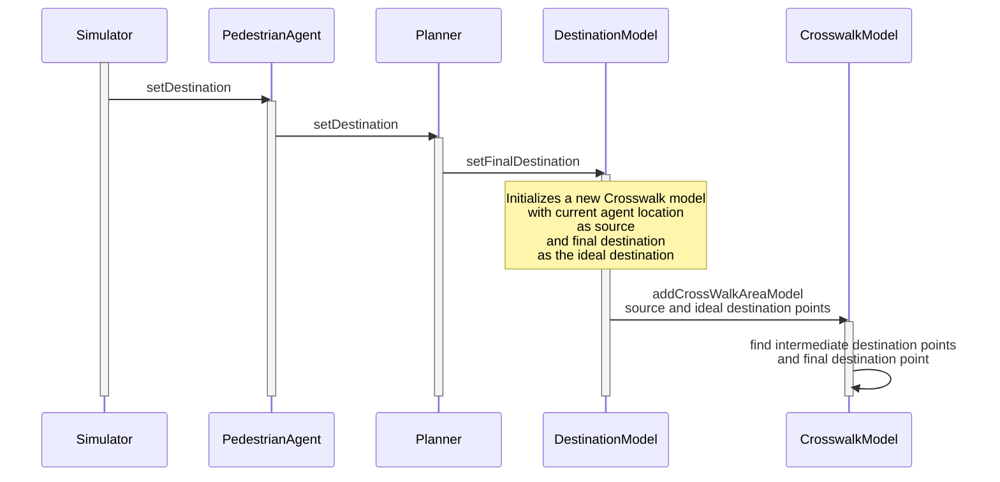
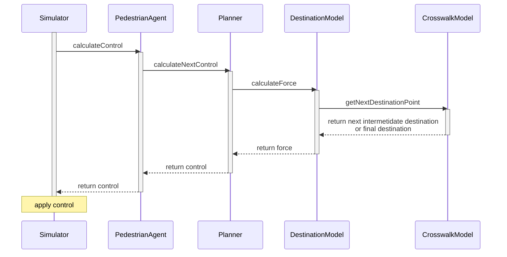

# Crosswalk Area model

The purpose of this model is to give a guidance to the pedestrian walkers to follow a high-level path which resembles a real-world path. This model will make sure that the simulation covers real-world trajectories. In a given situation, real-world pedestrians exhibit different trajectories based on their internal factors such as the goal destination.

The model takes the source point and the ideal destination point as the inputs, then it creates intermediate destination points on the road and the final destination points on the sidewalk on the other side of the road. Pedestrian are given the objective to cross the road by passing through the intermediate destination points. But their force models will create variations given a set of such intermediate destination points.

We have a **destination model** that creates the destination force. So, the cross-walk model will be integrated into the destination model. The destination model will decide the next destination point and create the force on the pedestrian to move towards that point.

Now crosswalk area model requires the local-coordinate system for the pedestrian where the source point is the origin, and y axis is the ideal path along the cross walk.

**Initialization**

**Progression**

## How to use it
To use it we need to set an internal factor "use_crosswalk_area_model" to true. To set it please follow the [pedestrian configuration documentation](./pedestrian-configuration.md)

## Visualization

# TODO:
1. Build the crosswalk model with areaPolygon and goalline as inputs 
2. automate the caculation of the goal line
3. automate the calculation of the areaPolygon
4. Integrate crosswalk model with DestinationModel