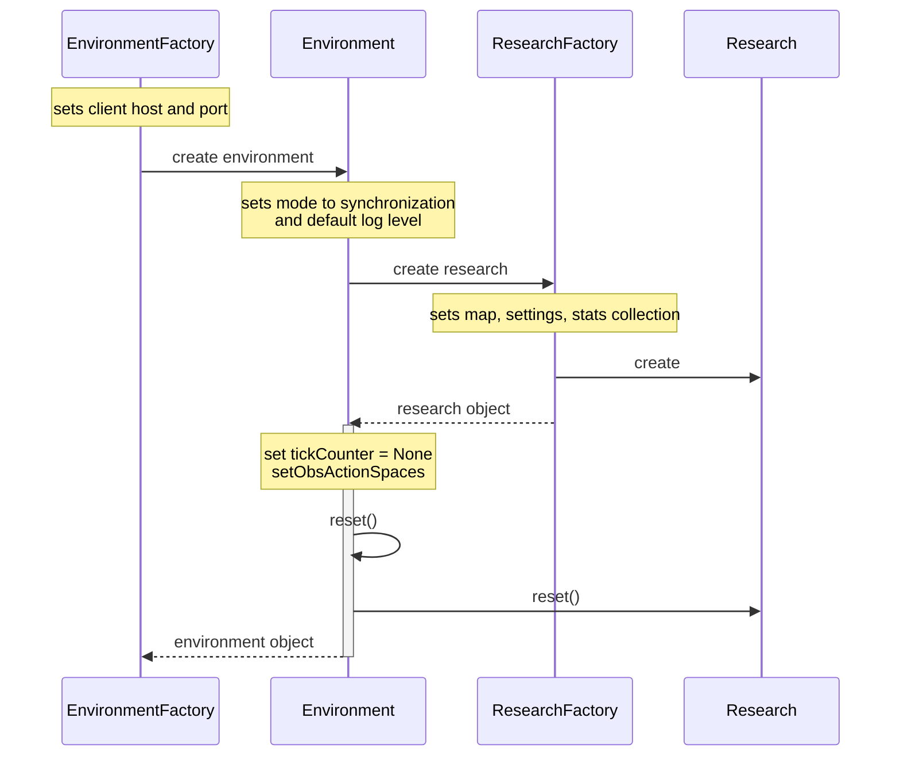
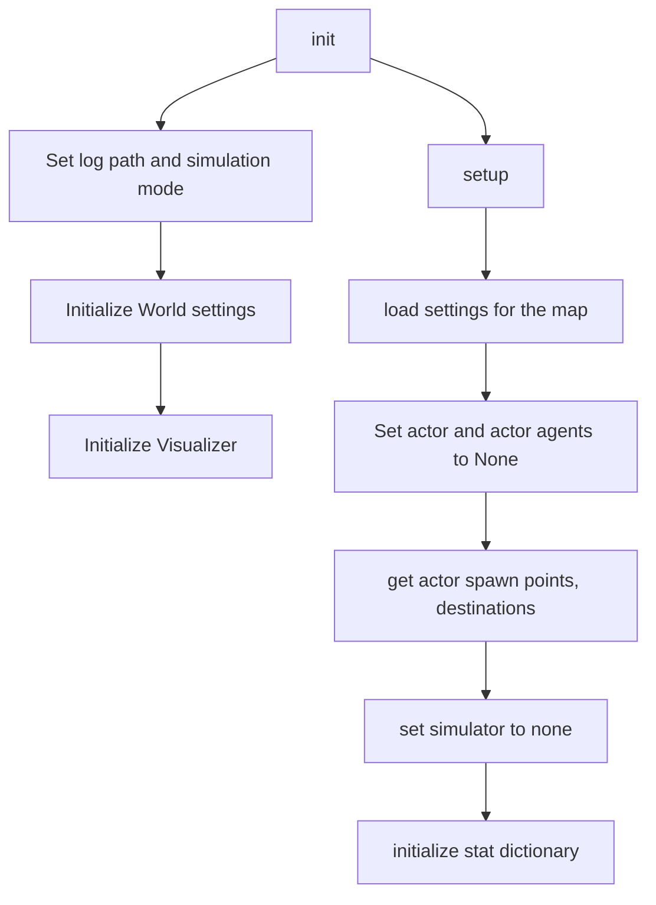
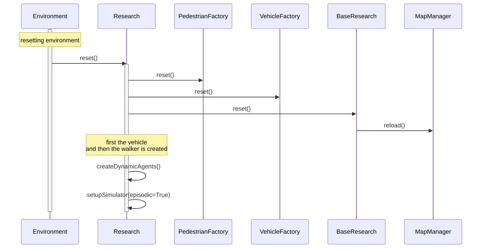
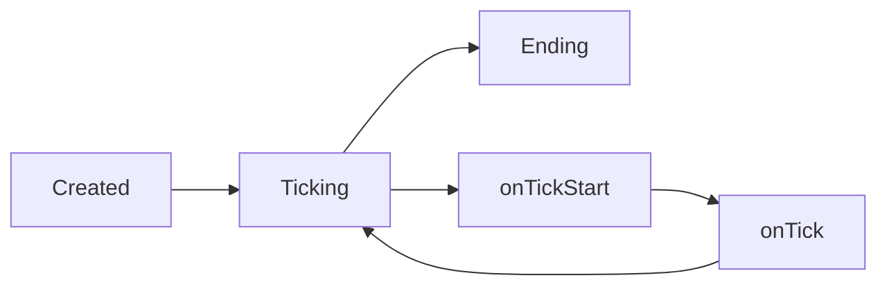
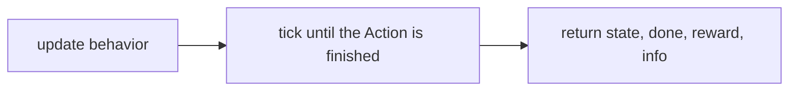

# Environments with Gym interface

We provide Open AI Gym environment to run our research

## Usage

### Creating an environment
```
from research.adversaries.EnvironmentFactory import EnvironmentFactory, AvailableEnvironments

env = EnvironmentFactory.create(AvailableEnvironments.R1V1Env1)

```

## Implementation

### Available environments
there is a enum class that lists the available environments: **research.adversaries.EnvironmentFactory.AvailableEnvironments**

### Components



### Environment setup

#### Creating a research in synchronized mode and collect statistics of episodes


### Environment reset



### Simulator lifecycle

#### Episodic simulator



### Environment step

