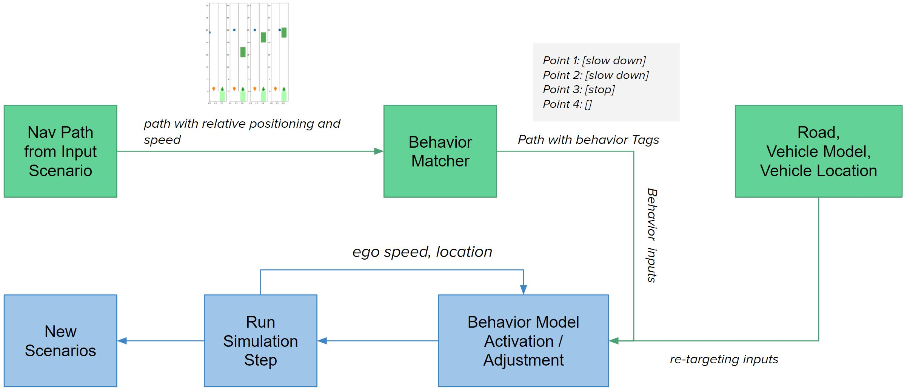

# Soft Pedestrian Modeling

Given a pedestrian crossing video, we want to generate scenarios that shows similar pedestrian behavior with contextual variations. We can achieve this by retargeting the behavior of pedestrians against:
1. Number of lanes in the road
2. Width of lanes
3. Ego vehicle’s lane
4. Ego vehicle’s speed profile

 
In this video, the pedestrian walks along the left lane for a while, and starts crossing the road. When it sees an approaching vehicle, it makes a stop on the left lane. We can retarget this behavior by expressing the behavior as a relative navigation path with respect to the ego vehicle.

## Approach
1. We extract minimal information (interesting points) from a real-world scenario (video/trajectory data) that can be reconstructed in different contexts. 

2. In the reconstruction process, we introduce social-force/rule-based models to produce behaviors at the interesting points.

## Demo

In the following video, PSI-0002 Scenario Reconstructed and Retargeted using Soft Pedestrian Modeling for AV Testing. Access to the PSI dataset is [here](https://github.com/PSI-Intention2022/PSI-Dataset).

<iframe width="420" height="315"
    src="https://youtube.com/shorts/ygUYhyuXlPE?feature=share">
</iframe>